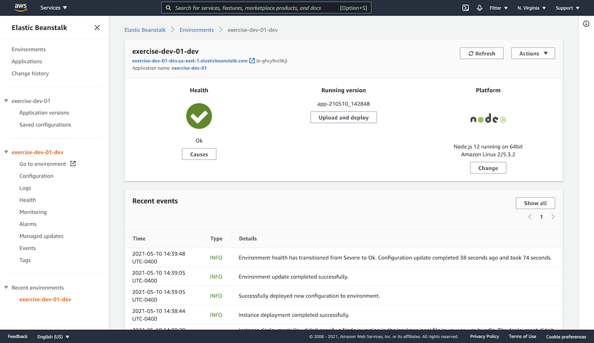
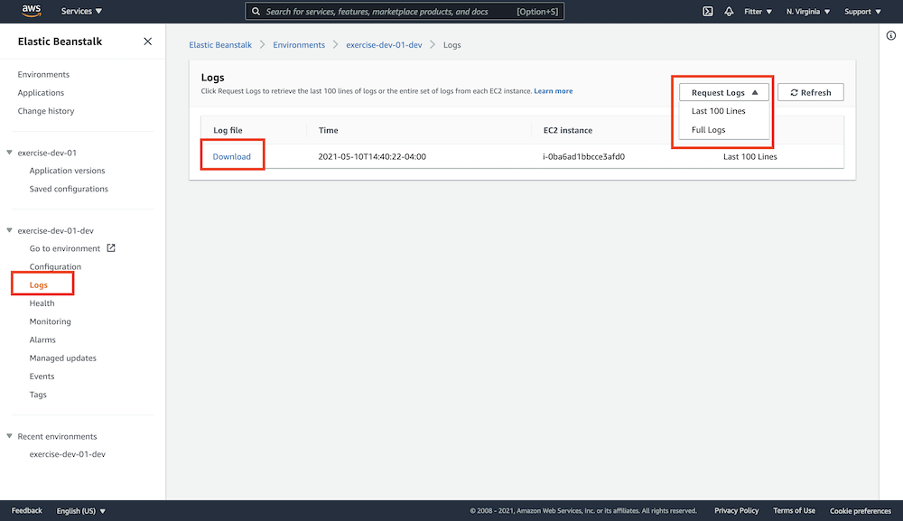

# AWS Deployment (Part 1)

### `Key Word: Node AWS S3 RDS Elastic beanstalk Typescript.`

- #### Click here: [BACK TO NAVIGASTION](https://github.com/DonghaoWu/WebDev-tools-demo/blob/master/README.md)

## `Section: Backend.`(Basic)

### `Summary`: In this documentation, we learn to add deploy a node application on AWS.

### `Check Dependencies & Tools:`

- dotenv

------------------------------------------------------------

#### `本章背景: `
1. 本章用到的全部资料：

------------------------------------------------------------

### <span id="1.0">`Brief Contents & codes position`</span>

- #### Click here: [BACK TO NAVIGASTION](https://github.com/DonghaoWu/WebDev-tools-demo/blob/master/README.md)

- [1.1 Outline.](#1.1)
- [1.2 Prerequisites - Part 1](#1.2)
- [1.3 Prerequisites - Part 2](#1.3)
- [1.4 Run the app locally.](#1.4)
- [1.5 Deploy with Elastic beanstalk.](#1.5)
- [1.6 Add environment variables in EB console.](#1.6)
- [1.7 Debugging.](#1.7)
- [1.8 Cleaning up.](#1.7)

------------------------------------------------------------

### <span id="1.1">`Step1: Outline.`</span>

- #### Click here: [BACK TO CONTENT](#1.0)

    1. Clone the repo to your local machine.

    2. Run `npm i` within the repo directory to install the project dependencies.

    3. Install `dotenv`, create a new file `.env` in the project root directory.

    4. Set the AWS RDS instance variables in `.env`

    5. Set the AWS S3 instance variables in `.env`

    6. Set Elastic Beanstalk IAM credentials.

    7. Install EB CLI

    8. Install AWS CLI

    9. Set up RDS

    10. Set up S3

    11. Set up IAM

    12. 
    ```yml
        deploy:
            artifact: ./www/Archive.zip
    ```

    13. package.json
    ```json
        "start": "node server.js",
    ```

### <span id="1.2">`Step2: Prerequisites - Part 1.`</span>

- #### Click here: [BACK TO CONTENT](#1.0)

    1. Install dependencies

        ```bash
        $ npm i
        $ npm update
        ```

    2. Install AWS CLI.
    - [Offical documentation](https://docs.aws.amazon.com/cli/latest/userguide/install-macos.html)

        ```bash
        $ curl "https://s3.amazonaws.com/aws-cli/awscli-bundle.zip" -o "awscli-bundle.zip"
        unzip awscli-bundle.zip
        sudo ./awscli-bundle/install -i /usr/local/aws -b /usr/local/bin/aws
        ```

    3. Install EB CLI

    - [Offical documentation](https://docs.aws.amazon.com/elasticbeanstalk/latest/dg/eb-cli3-install-osx.html)

        ```bash
        $ brew update
        $ brew install awsebcli
        $ eb --version #Verify that the EB CLI is installed correctly.
        ```

    4. dotenv.

        1. Install
            ```bash
            npm i dotenv 
            ```

        2. .env file

            ```bash
            POSTGRE_USERNAME=
            POSTGRE_PASSWORD=
            POSTGRE_DATABASE=
            POSTGRE_HOST=
            DIALECT=
            AWS_REGION=
            AWS_PROFILE=
            AWS_MEDIA_BUCKET=
            ```

        3. Require the package in your server - Add the following code on top of the `server.ts` file.
            ```js
            require('dotenv').config();
            ```

        4. Add .env to your .gitignore file
            ```bash
            .env
            ```

        5. Import .env variables in config.js
            ```js
            export const config = {
                "dev": {
                    "username": process.env.POSTGRE_USERNAME,
                    "password": process.env.POSTGRE_PASSWORD,
                    "database": process.env.POSTGRE_DATABASE,
                    "host": process.env.POSTGRE_HOST,
                    "dialect": process.env.DIALECT,
                    "aws_region": process.env.AWS_REGION,
                    "aws_profile": process.env.AWS_PROFILE,
                    "aws_media_bucket": process.env.AWS_MEDIA_BUCKET
                },
                "prod": {
                    "username": "",
                    "password": "",
                    "database": "",
                    "host": "",
                    "dialect": "postgres"
                }
            }
            ```

#### `Comment:`
1. So far, we should get these commands work:

    ```diff
    + aws --v
    + eb --version
    ```

### <span id="1.3">`Step3: Prerequisites - Part 2`</span>

- #### Click here: [BACK TO CONTENT](#1.0)

1. Configuring AWS Relational Database Service

    1. Create a database

        ```diff
        + RDS
        + Create database
        + PostgreSQL
        + Free tier
        + select public access
        + * Create database
        ```

    - `important: Remember the credentials settings.`
        - db identifier:`exercisedb`
        - username:`exercisedb`
        - password:`exercisedb`
        - database:`postgres`
        - endpoint:`database-1.c373g1a9htmv.us-east-1.rds.amazonaws.com`

    - `set the variables in .env file`

        ```json
        POSTGRE_USERNAME=exercisedb
        POSTGRE_PASSWORD=exercisedb
        POSTGRE_DATABASE=postgres
        POSTGRE_HOST=database-1.c373g1a9htmv.us-east-1.rds.amazonaws.com
        DIALECT=postgres
        AWS_REGION=us-east-1
        AWS_PROFILE=default
        AWS_MEDIA_BUCKET=
        ```

    2. Allowing Public Traffic to RDS

        ```diff
        + VPC security groups
        + Edit inboundrules
        + PostgreSQL/source:anywhere
        ```

2. Creating an S3 Filestore Bucket in AWS

    1. Bucket name: exercise-s3-01
    2. encryption key type: SSE-S3
    3. Bucket CORS policy. (Permissions tag/sroll down to buttom).
        ```json
        [
            {
                "AllowedHeaders": [
                    "*"
                ],
                "AllowedMethods": [
                    "PUT",
                    "POST",
                    "DELETE",
                    "GET",
                    "HEAD"
                ],
                "AllowedOrigins": [
                    "*"
                ],
                "ExposeHeaders": []
            }
        ]
        ```

    4. `set the variables in .env file`

        ```json
        POSTGRE_USERNAME=exercisedb
        POSTGRE_PASSWORD=exercisedb
        POSTGRE_DATABASE=postgres
        POSTGRE_HOST=exercisedb.c373g1a9htmv.us-east-1.rds.amazonaws.com
        DIALECT=postgres
        AWS_REGION=us-east-1
        AWS_PROFILE=default
        AWS_MEDIA_BUCKET=exercise-s3-01
        ```

3. AWS account, IAM

    1. Create a new policy, in visual editor: 
        ```diff
        + s3
        + all actions
        + Resources
        + specific
        + bucket => Add ARN (copy new bucket name)
        + object => Add ARN (same new bucket name, *)

        + *final name the policy name
        ```

    2. Create a new group, attach a the new policy that is created in step 1.

    3. Create a new user, with Programmatic access. Add this user to the group which is created in step 2. `Download the user profile csv file`.

    4. Install AWS User IAM Profiles Locally

        ```bash
        $ aws configure 
        # paste the user key pairs
        # input region
        ```

    5. check user profile configuration.
        ```bash
        $ cat ~/.aws/config
        $ cat ~/.aws/credentials
        ```

    6. Create IAM Service `EC2` Roles.

        ```diff
        + IAM console
        + create role
        + choose EC2
        + attach the new policy
        + name the Role name
        ```

#### `Comment:`
1. We get new assets:
    ```diff
    + a new database identifier: exercisedb
    + a new S3 bucket: exercise-s3-01
    + a new s3 policy: exercise-policy-01
    + a new user group: exercise-group-01
    + a new user: exercise-user-01
    + a new EC2 s3 role: exercise-dev-ec2-01
    ```

2. Set these variables:

    ```json
    POSTGRE_USERNAME=exercisedb
    POSTGRE_PASSWORD=exercisedb
    POSTGRE_DATABASE=postgres
    POSTGRE_HOST=exercisedb.c373g1a9htmv.us-east-1.rds.amazonaws.com
    DIALECT=postgres
    AWS_REGION=us-east-1
    AWS_PROFILE=default
    AWS_MEDIA_BUCKET=exercise-s3-01
    ```

3. Get these commands work:

    ```bash
    $ cat ~/.aws/credentials
    $ cat ~/.aws/config
    ```
    
### <span id="1.4">`Step4: Run the app locally.`</span>

- #### Click here: [BACK TO CONTENT](#1.0)

1. Add new routes. # ./src/controllers/v0/feed/routes/feed.router.ts

    ```ts
        //@TODO
        //Add an endpoint to GET a specific resource by Primary Key

        router.get('/:id', async (req: Request, res: Response) => {
            const id = req.params.id;
            const item = await FeedItem.findByPk(id);
            res.send(item);
        });

        // update a specific resource

        router.patch('/:id',
            requireAuth,
            async (req: Request, res: Response) => {
                //@TODO try it yourself

                const updatedItem = await FeedItem.update(req.body, {
                    where: {
                        id: req.params.id
                    },
                    returning: true,
                })

                res.send(updatedItem[1][0].dataValues);
            });
    ```

2. Run the app

    ```bash
    $ npm run dev
    ```

3. test the routes in postman.

    1. General.(Get)
        ```diff
        + http://localhost:8080
        ```

    2. Post a feed.(Post)
        ```diff
        + http://localhost:8080/api/v0/feed
        + Headers: Content-Type : application/json
        + body: row
            {
                "caption":"gill",
                "url":"test.jpg"
            } 
        ```

    3. Patch a feed.(Patch)
        ```diff
        + http://localhost:8080/api/v0/feed/:id
        + Headers: Content-Type : application/json
        + body: row
            {
                "caption":"patch gill",
                "url":"test.jpg"
            }
        ```

    4. Get a feed by id.(Get)
        ```diff
        + http://localhost:8080/api/v0/feed/:id
        ```

    5. Get a put signed url for a feed.(Get)
        ```diff
        + http://localhost:8080/api/v0/feed//signed-url/:fileName
        + Headers: Content-Type : application/json
        + body: row
            {
                "caption":"patch gill",
                "url":"test.jpg"
            }
        ```

    6. Use the put signed url to upload an image.(Put)
        ```diff
        + https://exercise-s3-01.s3.amazonaws.com/test?X-Amz-Algorithm=...
        + Headers: Content-Type : image/jpeg
        + body: binary
        + select an image
        ```

#### `Comment:`
1. 

### <span id="1.5">`Step5: Deploy with Elastic beanstalk.`</span>

- #### Click here: [BACK TO CONTENT](#1.0)

    1. Add EB Permission to user `(not group)`.
        ```diff
        + IAM
        + User:exercise-user-01
        + Permissions tag
        + Add permissions/Attach Policies
            + AdministratorAccess-AWSElasticBeanstalk
            + AdministratorAccess(temp)
        ```

    2. EB initialization.
        ```bash
        $ eb init
        $ 1 # us-east-1
        $ exercise-dev-01 # create new application
        $ Y # node.js
        $ 2 # Node.js 12
        $ Y # SSH
        $ Y # KeyPair
        ```

    3. Add a new code in file `config.yml`
        ```yml
        deploy:
            artifact: ./www/Archive.zip
        ```

    - config.yml example
        ```yml
        branch-defaults:
            default:
                environment: exercise-dev-01-dev
                group_suffix: null
        deploy:
            artifact: ./www/Archive.zip
        global:
            application_name: exercise-dev-01
            branch: null
            default_ec2_keyname: aws-eb
            default_platform: Node.js 12 running on 64bit Amazon Linux 2
            default_region: us-east-1
            include_git_submodules: true
            instance_profile: null
            platform_name: null
            platform_version: null
            profile: null
            repository: null
            sc: null
            workspace_type: Application
        ```

    - sometime may have error:`ERROR: TypeError :: string indices must be integers` if this file format is not correct.

    4. check the `start` script in `package.json`
        ```json
        "start": "node server.js"
        ```

    5. Create the build folder and deploy.
        ```bash
        $ npm run build
        $ eb create
        ```

#### `Comment:`
1. 

------------------------------------------------------------

### <span id="1.6">`Step6: Add environment variables in EB console.`</span>

- #### Click here: [BACK TO CONTENT](#1.0)

    1. EB console

        ```diff
        + Elastic Beanstalk
        + Application tag
        + Click exercise-dev-01-dev
        + Configuration tag
        + software Edit
        + Add Environment properties
        ```

        - :gem:`AWS_PROFILE: DEPLOYED`

    2. Add S3 access to EB role.

    <p align="center">
    
    </p>

    --------------------------------------------------

### <span id="1.7">`Step7: Debugging.`</span>

- #### Click here: [BACK TO CONTENT](#1.0)

    1. Check EB logs

    <p align="center">
    
    </p>

    --------------------------------------------------

### <span id="1.8">`Step8: Cleaning up.`</span>

- #### Click here: [BACK TO CONTENT](#1.0)

    1. Delete sources list:
    ```diff
    - EB application
    - S3 bucket
    - RDS database
    - EC2 instances
    - Policy
    - Group
    - User
    ```

- 本章用到的全部资料：

    1. 

- #### Click here: [BACK TO CONTENT](#1.0)
- #### Click here: [BACK TO NAVIGASTION](https://github.com/DonghaoWu/WebDev-tools-demo/blob/master/README.md)